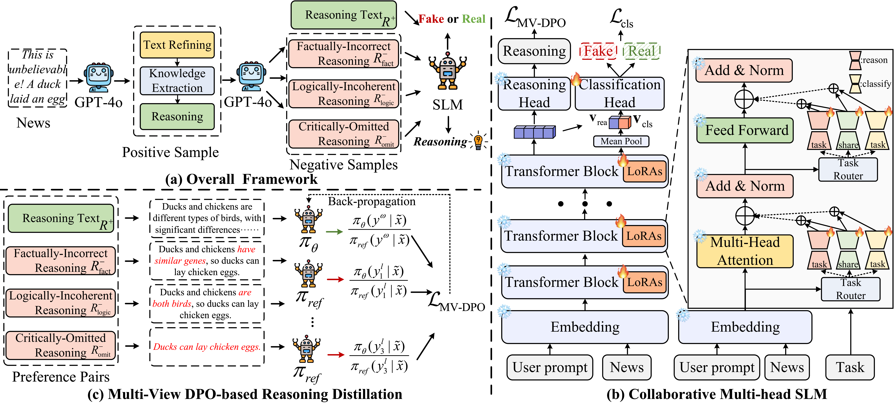

# Beyond Classification: Collaborative Reasoning and Detection with Small Language Models for Fake News Verification

This is an official implementation for **Beyond Classification: Collaborative Reasoning and Detection with Small Language Models for Fake News Verification**.

<p align="center">

<p>


## Directory Structure
```
|–– main.py   
|–– trainer.py
|–– model.py 
|–– data_loader.py
|–– utils.py
|–– config.py 
|–– requirements.txt    
|–– readme.md
```
## Requirements
You can run `pip install -r requirements.txt` to deploy the environment.

## Pretrained Model
**Qwen3-0.6B**: You can download the pretrained Qwen3-0.6B model from [Hugging Face](https://huggingface.co/Qwen/Qwen3-0.6B) and move all files into the `./pretrained_model` directory.

## Training
- **Start Training**: After processing the data, train the model by running:
```
python main.py \
    --model_path "./pretrained_model/Qwen" \
    --output_dir "./result/Qwen/dpo" \
    --train_data_path "./data/goosip_train.json" \
    --test_data_path "./data/goosip_test.json" \
    --epochs 5 \
    --batch_size 32 \
    --lr 5e-5 \
    --device_ids "0,1,2,3"
```